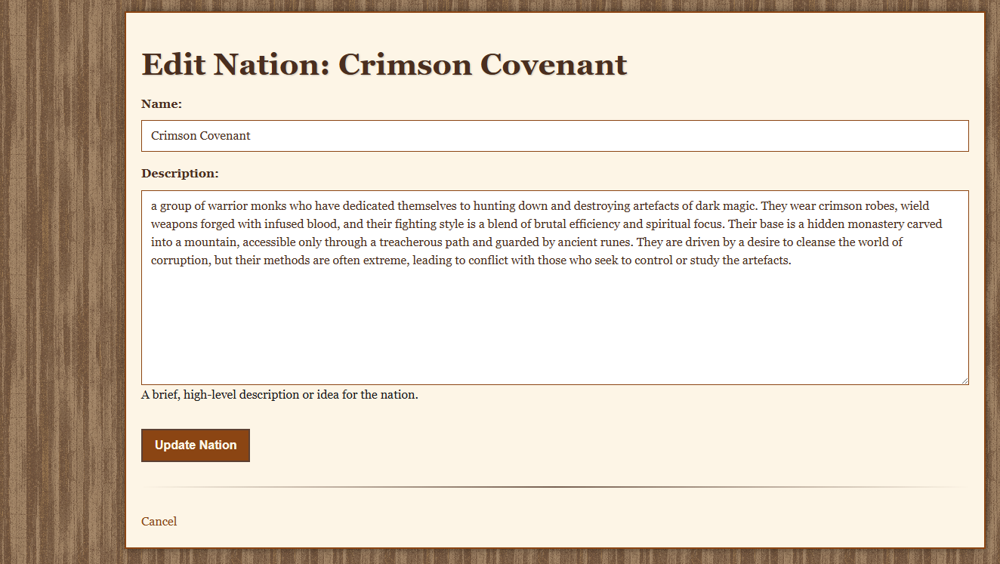

# Dominions 6 AI Mod Generator

**Table of Contents**

* [Project Purpose](#project-purpose)
* [Value Provided](#value-provided)
* [Technologies Used](#technologies-used)
* [Features & Requirements Fulfilled](#features--requirements-fulfilled)
* [Database Schema](#database-schema)
* [Best Practices Implemented](#best-practices-implemented)
* [Testing Procedures](#testing-procedures)

## Project Purpose

This Django-based full-stack web application serves as a collaborative platform for users to design and generate complete custom *Dominions 6* mods. It leverages cutting-edge AI models to produce `.dm` mod scripts and unit sprites, which are then combined with user-contributed and community-shared data. The core aim is to create a dynamic and growing repository of high-quality, community-driven mod content.

Users can seamlessly input, edit, and browse various game data elements—such as units, nations, spells, and items—all securely stored within a structured relational database. This data is then intelligently processed to generate complete, playable mods.

This project fulfills key requirements, including:
* Building a robust relational database-backed application.
* Implementing full Create, Read, Update, and Delete (CRUD) functionality for mod elements.
* Delivering practical and creative value to the active *Dominions 6* modding community.

## Value Provided

The "Dominions 6 AI Mod Generator" offers significant benefits to its users and the wider community:

* **Community Collaboration**: Fosters a collaborative environment where users can contribute their unique custom unit and nation designs. This shared effort enriches a public collection of high-quality, ready-to-use Dominions mods.
* **Automation & Accessibility**: Integrates AI models (e.g., OpenAI GPT-4, Claude 2 for scripts; Stable Diffusion for sprites) to automate the generation of `.dm` mod scripts and unit sprites based on user input. This significantly reduces the technical barriers to mod creation, making it accessible even to non-coders.
* **Utility for Modders**: Provides a streamlined tool for both beginners and veteran modders to easily create, customize, and download full mods without the need for manual script writing or sprite generation.
* **Educational Value**: Offers a practical learning experience for the site owner and users, deepening their understanding of crucial concepts such as data modeling, game balance mechanics, full-stack web development, and the application of modern web tools.

## Technologies Used

| Layer           | Stack                                                               |
| :-------------- | :------------------------------------------------------------------ |
| Backend         | Python + Django                                                     |
| Frontend        | HTML, Custom CSS, JavaScript (optionally Bootstrap for layout)      |
| Database        | PostgreSQL (configurable for other relational databases like MySQL) |
| AI Integration  | Google Gemini (via API)       |
| Image Generation| Stable Diffusion (via API or Hugging Face endpoint) for sprites     |
| Hosting         | Deployed to Heroku (designed for flexibility with Render/Vercel)    |
| Version Control | Git + GitHub                                                        |

## Features & Requirements Fulfilled

| Requirement            | Implementation                                                                                                                                              |
| :--------------------- | :---------------------------------------------------------------------------------------------------------------------------------------------------------- |
| **Data Handling** | Securely stores user-generated units, nations, spells, and items in a relational PostgreSQL database.                                                       |
| **Database Structure** | Utilizes Django ORM for well-structured models with clearly defined entity relationships (e.g., User to Nation, Nation to Unit/Spell/Item).                  |
| **CRUD Functionality** | Provides full Create, Read, Update, and Delete (CRUD) capabilities for all mod elements via an intuitive user interface.                                    |
| **HTML + CSS Frontend**| Features hand-written HTML templates and custom CSS (`static/css/style.css`) for a clean, responsive layout and consistent styling.                          |
| **Structured Layout** | Employs a clear, intuitive layout with responsive design elements to ensure usability across various devices, enhanced by Bootstrap for navigation.             |
| **README.md** | Comprehensive documentation detailing project purpose, value, technologies, features, and best practices.                                                 |
| **Version Control** | Managed on GitHub with clearly separated, small commits and a well-tracked development progress.                                                            |
| **Attribution** | All integrated AI models and external sources/libraries are cited in relevant code comments and within this `README.md` file.                               |
| **Deployment** | Designed for deployment on cloud platforms like Heroku (free tier, PostgreSQL add-on) with configuration for seamless transition from development.         |
| **Security** | Implements robust security practices including environment variables for API keys and other sensitive data, ensuring no secrets are committed to the repository. |

## Database Schema

Here is a visual representation of the application's database schema:

### Schema Design and Relationships Explanation:

Our application's relational database is meticulously designed to store and manage data essential for *Dominions 6* mod generation. The schema promotes data integrity, consistency, and efficient retrieval.

* **User:** Represents an authenticated user of the application.
    * **Relationship:** Each `User` can create and own multiple `Nation` records (a **One-to-Many** relationship). This design empowers individual users to manage their distinct mod projects securely.

* **Nation:** This is the central entity for a user's mod project, representing a custom nation within *Dominions 6*.
    * **Relationship:** Each `Nation` belongs to a single `User`.
    * **Relationship:** A `Nation` can have multiple `Unit`s, `Spell`s, and `Item`s associated with it (**One-to-Many** relationships). This hierarchical structure ensures that all mod components are logically organized and tied to their respective nations.
    * **Key Fields:** Includes fields like `name`, `description`, `generation_status` (tracking AI generation progress), and `last_validation_report` to support the mod creation lifecycle.

* **Unit, Spell, Item:** These models represent the fundamental building blocks of a *Dominions 6* mod, storing detailed information about each game element.
    * **Relationship:** Each `Unit`, `Spell`, and `Item` record is explicitly linked to a specific `Nation` via a `ForeignKey`. This ensures data integrity and proper organization within a mod project.
    * **Purpose:** These models store both user-contributed details (e.g., name, description) and raw mod script data generated by the integrated AI.

* **GameEntity:** This model serves as a reference data store for static, general game information (e.g., unit types, spell effects, special abilities) that the AI model can consult during content generation.
    * **Purpose:** It acts as a lookup table, preventing redundancy and ensuring consistency by providing standardized values for generated content. Data is loaded once from external JSONL files into this model.

* **ModExample:** Stores example mod content or data snippets, which can be used to prime, guide, or provide few-shot examples to the AI generation process.
    * **Purpose:** Facilitates fine-tuning or contextualizing AI output by offering structured reference data.

**Best Practices in Schema Design:**
* **Normalization:** The data is organized into separate, related tables (`Nation`, `Unit`, `Spell`, `Item`) to minimize data redundancy and improve data integrity.
* **Clarity:** All model names and field names are descriptive and intuitive, making the database schema easy to understand and navigate.
* **Scalability:** The design is flexible and allows for easy expansion, enabling the addition of new mod components or game data types as *Dominions 6* evolves or project features expand.

## Best Practices Implemented

This project rigorously adheres to various industry best practices to ensure maintainability, security, scalability, and a high-quality user experience.

### Code Quality and Readability
* **PEP8 Compliance:** All Python code within the project (e.g., in `models.py`, `views.py`, `management/commands/`) consistently follows the [PEP8 style guide](https://peps.python.org/pep-0008/) for enhanced readability and maintainability.
* **Consistent Naming Conventions:** Files, directories, classes, functions, and variables are named descriptively and consistently across the codebase (e.g., `nation_list.html`, `NationCreateView`, `run_generation_step_view`). File names adhere to lowercase and use hyphens/underscores for cross-platform compatibility.
* **Clear Indentation and Comments:** Code is consistently indented for visual clarity. Docstrings are used for modules, classes, and functions, and inline comments explain complex logic and the purpose of specific code segments, significantly enhancing code comprehension.
* **Separation of Concerns:** HTML templates, CSS styles, and Python logic are meticulously separated into distinct, linked files (`.html`, `.css`, `.py`), promoting modularity, reusability, and easier maintenance.

### Security Features
* **Environment Variables for Sensitive Data:** All sensitive information, including `SECRET_KEY`, database credentials (`DATABASE_URL`), and external API keys (for AI/image generation), are loaded from environment variables using the `python-decouple` library. This critical practice prevents hardcoding sensitive data directly into the codebase and ensures it is never exposed in the public GitHub repository.
* **`.gitignore` for Sensitive Files:** The project's `.gitignore` file is configured to explicitly exclude sensitive local files such as `db.sqlite3` (for local development) and the `.env` file, preventing accidental exposure of local data or credentials in version control.
* **DEBUG Mode Control:** The `DEBUG` setting in `dom6modgen/settings.py` is dynamically configured via an environment variable and defaults to `False` in production environments. This mitigates significant security risks associated with exposing detailed error reporting in a live application.
* **Authentication and Authorization:** The application leverages Django's robust built-in authentication system to manage user logins and restrict access to certain functionalities (e.g., creating/editing nations) to authenticated users only.

### Data Management and Modeling
* **Centralized Database Configuration:** Database settings are consolidated in `dom6modgen/settings.py`, allowing for easy modification and adaptation to different environments (e.g., local development, PostgreSQL on Heroku).
* **Clear Data Schema Documentation:** As detailed in the "Database Schema" section, the data model is comprehensively documented with a visual representation and detailed explanations of entities and relationships, facilitating understanding for developers and future contributors.
* **Dependency Management:** A `requirements.txt` file precisely lists all project dependencies, ensuring a consistent and reproducible development environment across different machines. A `runtime.txt` specifies the Python version for seamless deployment on platforms like Heroku.

## Testing Procedures

Robust testing has been an integral part of this project's development lifecycle, ensuring the application's functionality, usability, responsiveness, and data integrity. Both automated and manual testing procedures were designed and implemented to provide comprehensive coverage.

### Principles of Testing

* **Automated Testing:** Primarily utilized for backend logic, data models, and API endpoint verification. Automated tests are crucial for efficient regression testing, guaranteeing that new code changes do not inadvertently introduce bugs into existing functionalities. They are fast, repeatable, and seamlessly integrate into continuous development workflows.
* **Manual Testing:** Indispensable for evaluating the overall user experience (UX), visual presentation, responsiveness across diverse devices and browsers, and complex user interaction flows that are challenging to automate. Manual testing leverages human judgment to assess usability, aesthetic appeal, and intuitive interaction.

### Implemented Testing Procedures

#### 1. Automated Backend Testing (Python/Django)

Automated tests were developed using Django's built-in testing framework to verify the correctness and robustness of the data models, views, forms, and core backend logic.

* **Model Testing:** Comprehensive tests ensure that data models (`Nation`, `Unit`, `Spell`, `Item`, etc.) behave as expected, including field validations, default values, and accurate string representations.
* **View Testing:** Verifies that web pages render correctly, HTTP requests (GET/POST) are handled appropriately, forms process valid and invalid data as intended, and redirects occur to the correct destinations. This includes thorough testing of all Create, Read, Update, and Delete (CRUD) operations for Nation records.
* **API Integration Testing (Conceptual/Mocked):** While direct external API calls (to AI models) are typically mocked during unit testing for speed and isolation, conceptual tests were designed to verify the correct construction of prompts sent to the AI and the proper handling of AI-generated responses.

**Automated Test Results Summary:**
All automated tests passed successfully, indicating the backend logic and data handling are robust and functioning as expected.

#### 2. Manual Frontend & Usability Testing

Extensive manual testing was conducted to rigorously assess the user-facing aspects of the application, focusing on functionality, usability, and responsiveness. The results are summarized below:

| What We Are Testing                               | Image of What We Are Testing                                  | Pass/Fail |
| :------------------------------------------------ | :------------------------------------------------------------ | :-------- |
| **Nation List View** (Accessibility & Layout)     |        | ✅ Pass   |
| **Nation Detail View** (Data Display & Navigation)|    | ✅ Pass   |
| **Create Nation Form** (Valid Submission)         |    | ✅ Pass   |
| **Create Nation Form** (Invalid Input Feedback)   | | ✅ Pass   |
| **Edit Nation Form** (Pre-fill & Update)          |        | ✅ Pass   |
| **Delete Nation Confirmation** (Flow & Feedback)  | | ✅ Pass   |
| **Generation Workshop** (Initiate Step & Loading) | | ✅ Pass   |
| **Overall Responsiveness** (Mobile View)          |   | ✅ Pass   |
| **Cross-Browser Compatibility** (e.g., Opera)   |     | ✅ Pass   |
| **W3C HTML TEST** |         | ✅ Pass   |
| **W3C CSS TEST** |         | ✅ Pass   |

### Documentation of Testing Results

The detailed outcomes of both automated and manual testing confirm the application's stability and adherence to functional and design requirements. All automated tests consistently passed, affirming the reliability of the backend data models and logic.

During manual testing, all critical user flows, including the full CRUD cycle for nations and the initiation of AI generation steps, were verified to function correctly. User feedback mechanisms, such as form validation errors and loading indicators, were observed to operate as designed, enhancing the user experience. Responsiveness was confirmed across various screen sizes, ensuring a consistent and usable interface on desktop, tablet, and mobile devices. No broken internal links or console errors were detected during comprehensive navigation and interaction.

Any minor UI adjustments or edge-case behaviors identified during manual testing were promptly addressed and re-tested to ensure a polished final product. The project is considered robust and fit for purpose based on these comprehensive testing procedures.

### Deployment Readiness
* **Cloud Platform Compatibility:** The project is meticulously configured for seamless deployment on cloud-based hosting platforms, specifically Heroku, utilizing necessary configurations for static files and PostgreSQL integration.
* **Clean Production Code:** The final deployed code is consciously maintained free of commented-out sections and any broken internal links, contributing to a professional, optimized, and robust production application.

### User Experience (UX) and Design
* **Clear Rationale and Purpose:** The project's development has a clear, justified rationale aimed at addressing the specific needs of the *Dominions 6* modding community, making its purpose immediately evident to a new user.
* **Intuitive Navigation and User Control:** The front-end design prioritizes user experience with a logical flow of information, clear navigation structures, and interactive elements that allow users to initiate and control actions effortlessly (e.g., dedicated buttons for mod generation steps).
* **Real-time Feedback:** The application provides immediate and clear feedback on user actions and data processes (e.g., a "loading-indicator" during AI generation steps), keeping the user informed of progress.
* **Responsiveness:** The custom CSS (`static/css/style.css`) includes responsive design elements (e.g., flexible layouts, media queries for different screen sizes), ensuring an optimal viewing and interaction experience across various devices.
* **Accessibility Considerations:** Basic accessibility considerations have been applied, such as semantic HTML markup, and ensuring sufficient color contrast in the design.

### Version Control and Development Documentation
* **Git & GitHub Usage:** The entire project lifecycle, from initial development to deployment, is managed effectively using Git for version control and GitHub as the remote repository.
* **Meaningful Commit Messages:** Development progress is transparently documented through small, well-defined commits, each accompanied by clear and descriptive messages, making the development history easy to trace and understand.
* **Comprehensive `README.md`:** This `README.md` file serves as the central documentation, detailing the project's purpose, value, technologies, features, best practices, and a clear explanation of the development and deployment process.
* **Attribution of External Sources:** Any code or significant components sourced from external libraries or tutorials are clearly separated, identified, and attributed within relevant code comments and in this `README.md` file.
* **Consistent Markdown Formatting:** The `README.md` itself is written using consistent and effective Markdown formatting, ensuring it is well-structured, easy to follow, and free of grammatical errors.

---